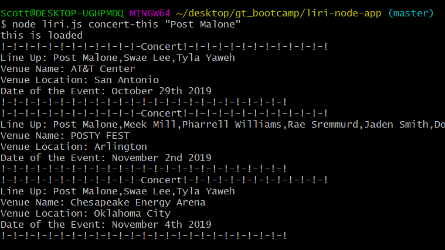
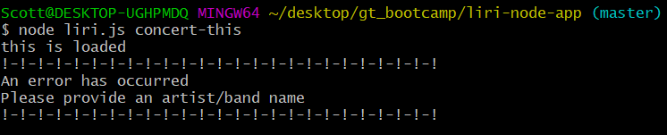
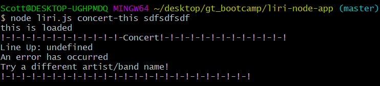

# liri-node-app

**Creator**: `Scott Ladd`

**Created on**: `Oct 30th 2019`

- - -

## ABOUT THE APP
LIRI is like iPhone's SIRI. However, while SIRI is a Speech Interpretation and Recognition Interface, LIRI is a Language Interpretation and Recognition Interface. LIRI is a command line node app that takes in parameters and gives you back data. The user has the option of using four commands (listed below) in conjuntion with specific parameters associated with the commands. The  `Commands` are:

   * `concert-this`

   * `spotify-this-song`

   * `movie-this`

   * `do-what-it-says`

## What Each Command Should Do

1. **Concert-this**
   * Provide the Line-up of Artist performing.
   * Name of the venue.
   * Venue location.
   * Date of the Event (format this as "MM/DD/YYYY").
2. **Spotify-this-song**
   * Artist.
   * The song's name.
   * A link to the song on Spotify.
   * The album that the song is from.
   * If no song is provided then the program will default to "The Sign" by Ace of Base.
3. **Movie-this**
   * Title of the movie.
   * Year the movie came out.
   * IMDB Rating of the movie.
   * Rotten Tomatoes Rating of the movie.
   * Country where the movie was produced.
   * Language of the movie.
   * Plot of the movie.
   * Actors in the movie.
   * If the user doesn't type a movie in, the program will output data for the movie 'Mr. Nobody'.
4. **Do-what-it-says**
   * It should run `spotify-this-song` for "I Want it That Way," as follows the text in the file random.txt.

- - -

## HOW TO USE LIRI
### **Step by Step instructions**

1. Clone the repository
2. Navigate to the folder that contains the `liri.js` file.
3. Run npm install, and the following packages should be installed:
   * [Node-Spotify-API](https://www.npmjs.com/package/node-spotify-api)
   * [Axios](https://www.npmjs.com/package/axios)
   * [Moment](https://www.npmjs.com/package/moment)
   * [DotEnv](https://www.npmjs.com/package/dotenv)
4. Go to <https://developer.spotify.com/my-applications/#!/> and obtain your key and secret. 
4. Now go into the Keys.js file and plug in your key and secret numbers. You numbers should be where the hashtags are:

```js
console.log('this is loaded');

exports.spotify = {
  id: #############,
  secret: ###############
};
```
5. Run the commands.

    **Example 1a**: Run the `concert-this` command with a search parameter
    
        node liri.js concert-this "name of artist or band"
    
    See screen-shot below:

    

    **Example 1b**: Run the `concert-this` command with no search parameter
    
        node liri.js concert-this
    
    See screen-shot below:

    

    **Example 1c**: Run the `concert-this` command with a invalid search parameter
    
        node liri.js concert-this "name of artist or band"
    
    See screen-shot below:

    

    **Example 2a**: Run the `spotify-this-song` command with a search parameter
    
        node liri.js spotify-this-song "name of song or artist/band"
    
    See screen-shot below:

    

    **Example 2b**: Run the `spotify-this-song` command with no search parameter
    
        node liri.js spotify-this-song "name of song or artist/band"
    
    See screen-shot below:

    

    **Example 2c**: Run the `spotify-this-song` command with a invalid parameter
    
        node liri.js spotify-this-song "name of song or artist/band"
    
    See screen-shot below:

    

    **Example 3a**: Run the `movie-this` command with a search parameter
    
        node liri.js movie-this "name of movie"
    
    See screen-shot below:

    

    **Example 3b**: Run the `movie-this` command with no parameter
    
        node liri.js movie-this "name of movie"
    
    See screen-shot below:

    

    **Example 3c**: Run the `movie-this` command with a invalid parameter
    
        node liri.js movie-this "name of movie"
    
    See screen-shot below:

    


    **Example 4**: Run the `do-what-it-says` command
        
        node liri.js do-what-it-says
    
    See screen-shot below:

    

- - -

## TECHNOLOGIES USED
* Javascript
* Nodejs
* Node packages:
    * Node-Spotify-API
    * Request
    * Moment
    * DotEnv
* APIs used:
    * Bands in Town
    * OMDB
* Git
* GitHub